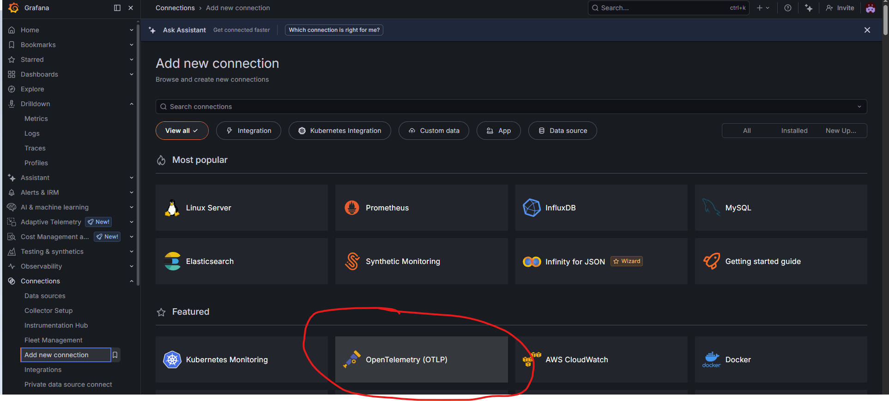
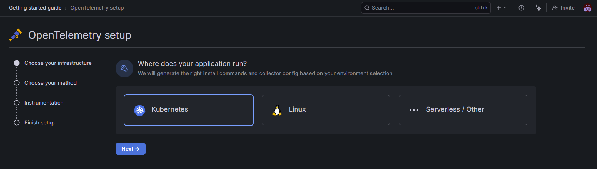
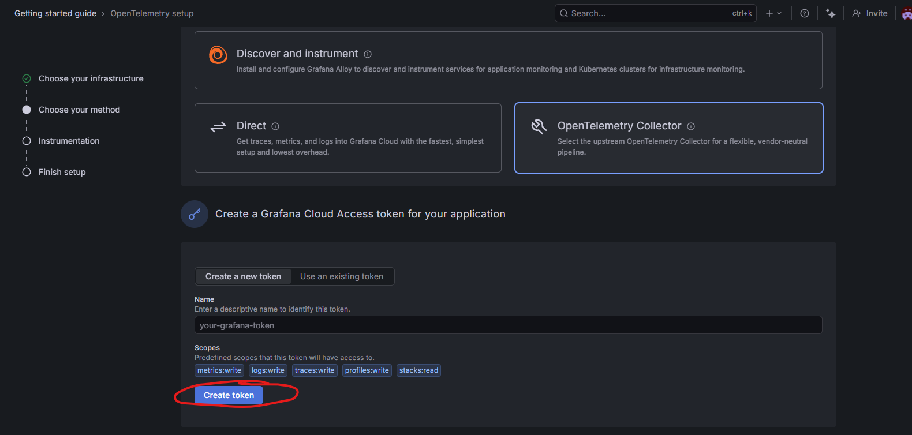
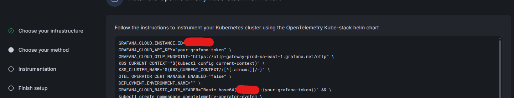

# Grafana Cloud — OpenTelemetry Testing Case

This testing case spins up a local KIND cluster with two .NET API services auto-instrumented via the OpenTelemetry Operator, exporting traces, metrics and logs to Grafana Cloud.

---

## 1. Fill in the `.env` file

Copy `.env.example` to `.env` and fill in your Grafana Cloud credentials. You can find all the values in the Grafana Cloud UI under **Connections → Add new connection → OpenTelemetry (OTLP)**.

```sh
cp kubernetes/testing-cases/grafana-cloud/.env.example kubernetes/testing-cases/grafana-cloud/.env
```

**Step 1** — Go to **Connections → Add new connection** and select **OpenTelemetry (OTLP)**:



**Step 2** — Choose **Kubernetes** as the infrastructure:



**Step 3** — Select **OpenTelemetry Collector** as the method, then create a new access token with the required scopes (`metrics:write`, `logs:write`, `traces:write`, `profiles:write`, `stacks:read`) and click **Create token**:



**Step 4** — Grafana will display the environment variables to fill in. Copy the values shown into your `.env` file:



The `.env` file should look like this:

```env
GRAFANA_CLOUD_INSTANCE_ID="<your instance id>"
GRAFANA_CLOUD_API_KEY="<your api key>"
GRAFANA_CLOUD_OTLP_ENDPOINT="https://otlp-gateway-prod-<region>.grafana.net/otlp"
K8S_CURRENT_CONTEXT="$(kubectl config current-context)"
K8S_CLUSTER_NAME="grafana"
DEPLOYMENT_ENVIRONMENT_NAME="PROD"
GRAFANA_CLOUD_BASIC_AUTH_HEADER="Basic <base64 encoded instance_id:api_key>"

# Change to true if cert-manager is installed in the cluster
OTEL_OPERATOR_CERT_MANAGER_ENABLED="false"
```

---

## 2. Run the full stack

From the **repo root**, run:

```sh
task test-grafana-cloud
```

This will:
1. Create the KIND cluster and wait for nodes to be ready
2. Install the OpenTelemetry Kube Stack via Helm (namespace, secret, Helm chart)
3. Wait for the operator and its mutation webhook to be fully ready
4. Build the `dotnet-api` Docker image and load it into the cluster
5. Deploy `dotnet-api` and `dotnet-api2`
6. Wait for both pods to be running with the OTel SDK injected
7. Port-forward `dotnet-api` to `localhost:80` — ready to test

Or run individual steps:

```sh
task start-cluster                        # create the KIND cluster
task grafana-cloud:setup                  # install OTel operator via Helm
task grafana-cloud:wait-for-operator      # wait for webhook to be ready
task grafana-cloud:build-and-load         # build image + load into KIND
task grafana-cloud:deploy-dotnet-api      # deploy dotnet-api
task grafana-cloud:deploy-dotnet-api2     # deploy dotnet-api2
task grafana-cloud:wait-for-apps          # wait for pods to be ready
task stop-cluster                         # tear everything down
```

Or just the grafana-cloud stack (cluster already running):

```sh
task grafana-cloud:full-setup
```

---

## 3. Test the APIs

Port-forward `dotnet-api` to `localhost:80`:

```sh
task grafana-cloud:port-foward
```

Then use the [testing.http](testing.http) file to send requests (works with the VS Code REST Client extension). It includes:

- `GET /message` — generates logs at all levels
- `GET /call-other` — calls `dotnet-api2`, producing a distributed trace across both services
- `POST /submit` — submits a payload

All requests will generate traces exported to Grafana Cloud. Check **Explore → Traces** in your Grafana Cloud instance to see them.
